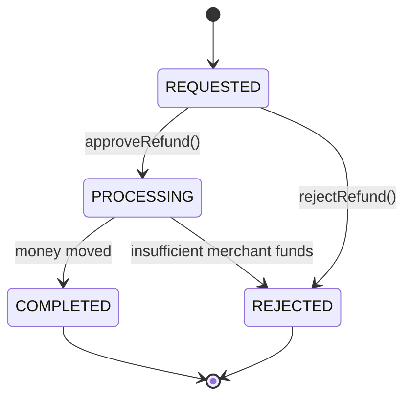

# 5. Class Diagram (Mermaid – renders on GitHub)

```mermaid
classDiagram
    class User { -userId -name -email -phoneNumber -passwordHash -accountStatus +updateProfile() +checkPassword() }
    class Wallet { -walletId -userId -balance -currency -walletStatus +addMoney() +withdrawMoney() +checkBalance() +transfer()$ }
    class BankAccount { -accountId -userId -accountNumber -bankName -ifscCode -verificationStatus +verifyAccount() +unlinkAccount() }
    class MoneyTransfer { -transferId -senderId -receiverId -amount -transferStatus +validateTransfer() }
    class Payment { -paymentId -userId -merchantId -paymentAmount -paymentMethod -paymentStatus }
    class Beneficiary { -beneficiaryId -ownerUserId -name -phoneNumber -bankAccountNumber +updateBeneficiary() }
    class Transaction { -transactionId -senderWalletId -receiverWalletId -amount -transactionType -transactionStatus +createTransaction()$ }
    class Refund { -refundId -transactionId -refundAmount -refundStatus +moveTo() }
    class Notification { -notificationId -userId -message -readStatus +markAsRead() }
    class Admin { -adminId -role -adminStatus +assertCanBlock() }
    class PaymentMethodHandler { <<interface>> +method() +collect() }
    class WalletPaymentHandler
    class GatewayPaymentHandler
    class PaySmartService { +register() +login() +sendMoney() +makePayment() +requestRefund() +approveRefund() +blockUser() +viewHistory() }

    User "1" --> "1" Wallet : owns
    User "1" --> "*" BankAccount : links
    User "1" --> "*" Beneficiary : saves
    User "1" --> "*" Notification : receives
    Wallet "1" --> "*" Transaction : records
    Payment --> Transaction : creates
    MoneyTransfer --> Transaction : creates
    Refund --> Transaction : refers to
    PaymentMethodHandler <|.. WalletPaymentHandler
    PaymentMethodHandler <|.. GatewayPaymentHandler
    Payment ..> PaymentMethodHandler : uses
    PaySmartService ..> User
    PaySmartService ..> Wallet
    PaySmartService ..> Admin
    PaySmartService ..> PaymentMethodHandler
```

## Refund state machine

```mermaid
stateDiagram-v2
    [*] --> REQUESTED
    REQUESTED --> PROCESSING : approveRefund()
    REQUESTED --> REJECTED : rejectRefund()
    PROCESSING --> COMPLETED : money moved
    PROCESSING --> REJECTED : insufficient merchant funds
    COMPLETED --> [*]
    REJECTED --> [*]
```
